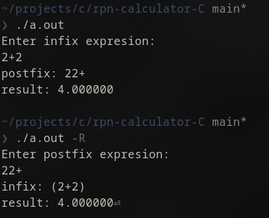

# rpn-calculator-C  
hanges input from infix to postfix and caclulates or from postfix to infix
# Usage
use with no arguments or -R
```bash
calculate
Enter infix expresion:
<infix>
```
OR 
```bash
calculate
Enter postfix expresion:
<postfix>
```

# Instalation
## Linux only:
Install libcstack and link it
```bash
git clone https://github.com/c0bra669/libcstack.git
cd libcstack
./install.sh
gcc -o calculate src/calc.c -lcstack
```
## OR
compile and link libstack staticly

# Dependencies
- libcstack
- GNU C
